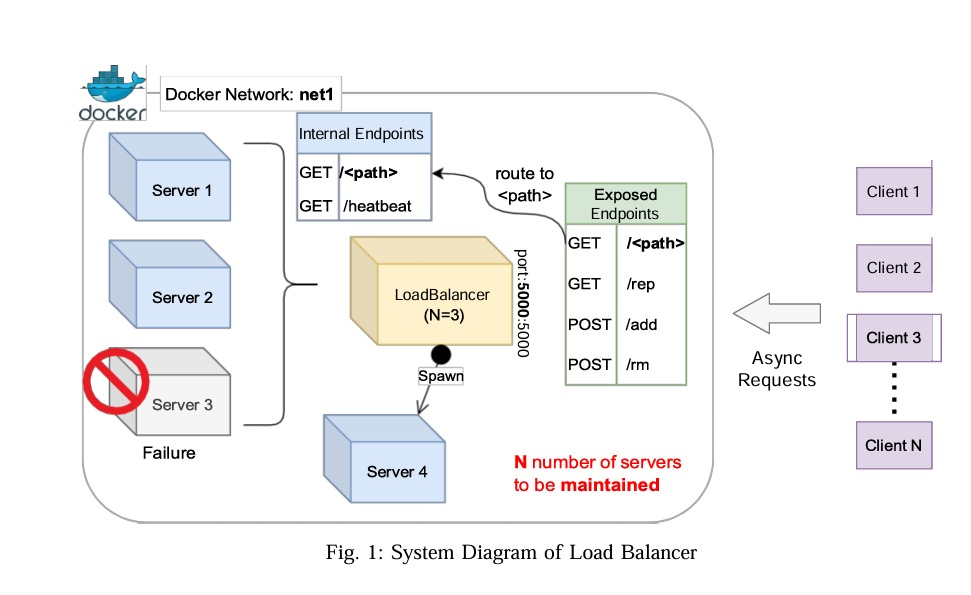

# Implementing a Customizable Load Balancer 

## Overview
This project is aimed at implementing a basic load balancing system using C++. The purpose of this system is to distribute incoming network traffic across multiple servers to ensure optimal performance and reliability.

